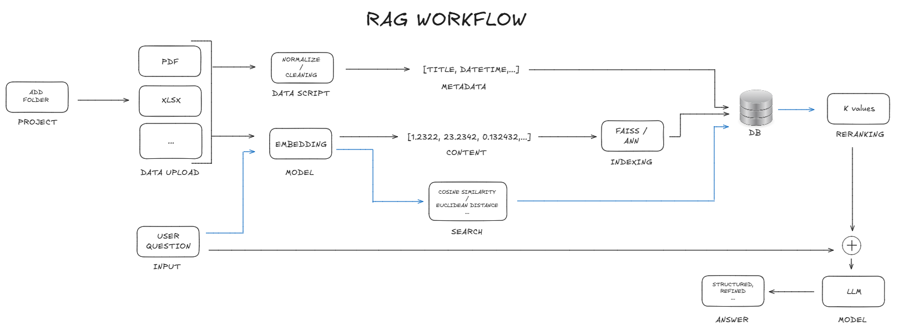
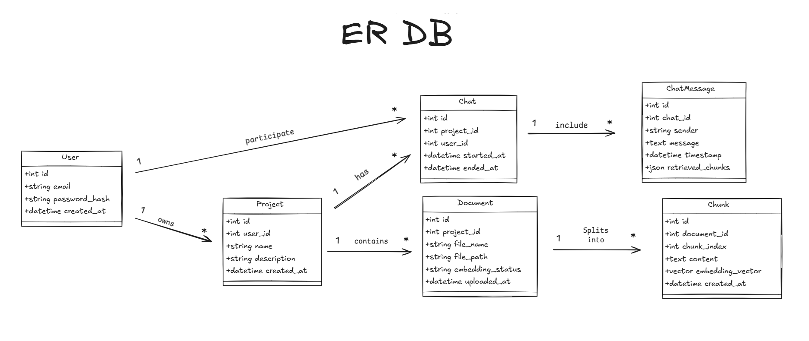

# Simple-AutoRAG

Simple-AutoRAG is a web application designed to facilitate the creation of Retrieve Augmented Generation (RAG) Project Chats by allowing users to upload documents. This powerful tool employs retrieval augmented generation techniques to enable intelligent, context-aware conversations tailored to the uploaded documents within specific projects.

## Features

- **Create Project Folders:** Organize your documents within dedicated project folders to maintain structured information.
- **Document Upload:** Add documents to your project folder to set a comprehensive context for RAG chats.
- **Intelligent Conversations:** Engage in discussions that understand and utilize the context provided by your documents.
- **Enhanced Chatbot Accuracy:** Improve the precision of chatbot responses using document retrieval methodologies.
- **User-Friendly Interface:** Navigate seamlessly through the application with an intuitive web interface.

## Workflow

The conceptual workflow of Simple-AutoRAG is depicted in the following image:



## DB

The conceptual relational schema diagram for the DB:



## Installation

To install and run Simple-AutoRAG, follow these steps:

1. **Clone the Repository:**

    ```bash
    git clone https://github.com/yourusername/Simple-AutoRAG.git
    ```

2. **Navigate to the Project Directory:**

    ```bash
    cd Simple-AutoRAG
    ```

3. **Start Services with Docker Compose:** Launch all necessary services for the application, including the frontend, database, and backend, using Docker Compose:

    ```bash
    docker-compose build
    docker-compose up -d
    ```

## Usage

1. **Access the Application:** Open your web browser and go to `http://localhost:5000`.
2. **Create a Project Folder:** Initialize a project folder to organize your documents.
3. **Upload Documents:** Use the provided interface to upload documents to your selected project folder.
4. **Engage in RAG Chats:** Once the documents are processed, start conversations that leverage the uploaded context.
5. **Ask Questions:** Utilize the chat interface to pose questions and receive responses that are informed by your documents.

## License

Simple-AutoRAG is available under the [MIT License](LICENSE).

## Contact

For inquiries or feedback, please contact me at `franmartinaguilar@gmail.com`.
